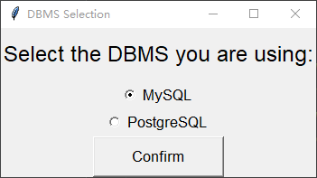
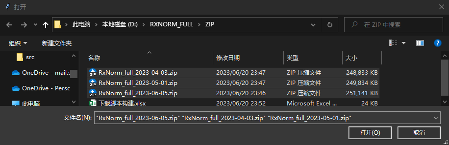
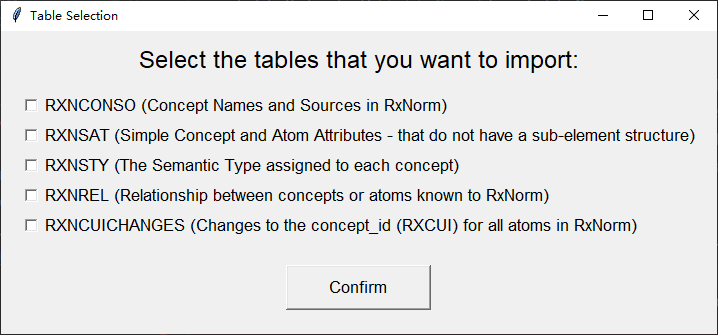

# Intro

This repository offers a Python script designed to facilitate the import of RxNorm files within a specific time period into both MySQL and PostgreSQL databases. With this tool, you can seamlessly manage and monitor changes across a range of RxNorm files, guaranteeing that your data comprehensively captures all alterations and information over the designated time frame. By leveraging this versatile importer, you can seamlessly conduct thorough data analysis within the specified period, empowering your research and insights.

# Before start

* The character set of RxNorm release files is Unicode UTF-8. 
* Additionally, make sure to read the README file for the release, which is contained in the release zip package. 
* For additional information about RxNorm releases, including scripts for loading the RxNorm data into Oracle and MySQL databases, refer to the [RxNorm Technical Documentation](https://www.nlm.nih.gov/research/umls/rxnorm/docs/index.html).

To get started, please follow the steps outlined below to set up the necessary prerequisites and import the RxNorm files into a MySQL database.

# Prerequisites

Before proceeding with the RxNorm database import, ensure that you have completed the following prerequisites.

## Sign Up for a UMLS  Terminology Services Account

To access the RxNorm files, you need to have a UMLS Terminology Services account. If you haven't done so already, sign up for an account at [Sign Up for a UMLS Terminology Services Account (Request a UMLS Metathesaurus License)](https://uts.nlm.nih.gov/uts/signup-login).

Fill the forms and wait until the UMLS License Request approved.

## Accessing the System

To sign in and access the system, visit the login page by accessing this link: [UTS Login](https://uts.nlm.nih.gov/uts/login).

## Download RxNorm Files

To obtain the RxNorm files, visit the [RxNorm Files Download Page](https://www.nlm.nih.gov/research/umls/rxnorm/docs/rxnormfiles.html) on the UMLS Terminology Services website. This page provides access to all the RxNorm releases.

> For users who wish to automate the download of the RxNorm releases, detailed steps are available [here](https://documentation.uts.nlm.nih.gov/automating-downloads.html). The RxNorm files are also available through generic URLs with the word "current" instead of specific dates. See below for examples:
>
> - https://download.nlm.nih.gov/umls/kss/rxnorm/RxNorm_full_current.zip
>   https://download.nlm.nih.gov/umls/kss/rxnorm/RxNorm_weekly_current.zip
>

> <div style="color:red;">Note: You should rename all the files to `[Any Prefix]_yyyy-mm-dd.zip`, this allows the sql script to read at the correct release time of a rxnorm release file<P>
>     e.g. 'RxNorm_full_2023-04-03.zip'
>     </P></div>
>
> To Achieve this, and download RxNorm releases automatically, using CURL is recommended, you can concat curls command line using Excel; And using `-o` option to rename a file;
>
> | A                        | B    | C    | D    | E                                               | F                                                            |
> | ------------------------ | ---- | ---- | ---- | ----------------------------------------------- | ------------------------------------------------------------ |
> | FileName                 | yy   | mm   | dd   | yy-mm-dd                                        |                                                              |
> | RxNorm_full_06052023.zip | 2023 | 06   | 05   | =CONCAT(B2,"-",TEXT(C2,"00"),"-",TEXT(D2,"00")) | =CONCAT("curl ","""","https://uts-ws.nlm.nih.gov/download?url=https://download.nlm.nih.gov/umls/kss/rxnorm/",A2,"&apiKey=",""""," -o ","RxNorm_full_",E2,".zip") |
> |                          |      |      |      |                                                 |                                                              |
> | Results:                 |      |      |      | 2023-06-05                                      | curl "https://uts-ws.nlm.nih.gov/download?url=https://download.nlm.nih.gov/umls/kss/rxnorm/RxNorm_full_06052023.zip&apiKey=[your API Key]" --max-time 7200  -o RxNorm_full_2023-06-05.zip |

## Install MySQL Or PostgreSQL Database 

To import the RxNorm files, you need to have a MySQL OR PostgreSQL database installed on your system. If you haven't installed, please refer to the documentation for instructions on how to download and install the appropriate version for your operating system.

**<u>For PostgreSQL, the version request is above 15.0</u>**, which support `NULLS NOT DISTINCT` to specifies that for a unique index, null values should be considered   equal to identify duplicate records with null fields.

# Importing RxNorm Files

Follow the steps below to import the RxNorm files into your database.

## Create Databases

Create a database in your database installation to store the RxNorm records.

### MySQL

 You can use the MySQL command line or a GUI tool such as phpMyAdmin to create the database.

```sql
CREATE DATABASE rxnorm;
```

### PostgreSQL

 You can use the command line or a GUI tool such as pgAdmin to create the database.

```sql
CREATE DATABASE rxnorm WITH ENCODING = 'UTF8';
```


## Create Tables through Existing SQL Script

Using the provided SQL script to create the required tables in the database. The SQL script contains the necessary table definitions and configurations to store the RxNorm data properly. Execute the SQL script using the command line or your preferred administration tool.

### MySQL

The provided SQL script for MySQL is `Table_scripts_mysql.sql`, execute the script in the command line. Make sure you are logged in to the database server and have selected the intended target database.

```sql
source Table_scripts_mysql.sql
```

### PostgreSQL

For PostgreSQL users, utilize the supplied SQL script named `Table_scripts_postgresql.sql`. Execute the script within the command line interface, ensuring you are logged in to the database server and have chosen the desired target database. This procedure will seamlessly configure the necessary tables for your RxNorm data within the PostgreSQL environment.

```sql
source Table_scripts_pgsql.sql
```


## Edit Database  Configuration in `settings.py`

Configuring the database settings for your Python script is a crucial step in ensuring that your application connects to the correct Database Management System (DBMS). Follow these steps to set up your database configuration in the `settings.py` file:

### Step 1: Open `settings.py`

Open the `settings.py` file using a text editor or an integrated development environment (IDE) of your choice.

### Step 2: Modify the Parameters

Modify the following parameters in the `settings.py` file to match your specific database configuration. Detailed explanations are provided below:

- `DB_USER`: Replace `[your_username]` with your DBMS user name.
- `DB_PASSWORD`: Replace `[your_password]` with your DBMS password.
- `DB_DATABASE`: Replace `[your_database]` with the name of your database.
- `DB_HOST`: Replace `[your_host]` with the hostname or IP address of your DBMS server. For local servers, use `127.0.0.1` or `localhost`.
- `DB_PORT`: Replace `[your_port]` with the port of your DBMS server. The default is `3306` for MySQL and `5432` for PostgreSQL.
- `DB_TARGET_SCHEMA`: Only if you are using PostgreSQL, do you need to set this target schema name, default: public

### Example for MySQL

If you're using a locally hosted MySQL server with a username of `'root'`, a password of `'password123'`, and a database named `'rxnorm'`, your modified `settings.py` file should look like this:

```python
# DB Connection Configuration
DB_PASSWORD = 'password123'
DB_DATABASE = 'rxnorm'
DB_HOST = 'localhost'
DB_PORT = 3306
```

### Example for PostgreSQL

If you're using a locally hosted PostgreSQL server with the same credentials as the MySQL example, and you want to specify a target schema, your `settings.py` file would look like this:

```python
# DB Connection Configuration
DB_PASSWORD = 'password123'
DB_DATABASE = 'rxnorm'
DB_HOST = 'localhost'
DB_PORT = 5432
# set target schema name, default: public
target_schema= 'test_pg_schema'
```

> **Note:** The default schema in PostgreSQL is 'public'. If you've created a different schema, specify it in `DB_TARGET_SCHEMA` as shown in the example above.

### Step 3: Save Changes

Make sure to save the changes you've made to the `settings.py` file.

By following these steps, you'll ensure that your script connects to the correct DBMS server and database during the RxNorm file import process.


## Ensure Python Runtime Dependency

Before running the `RXNORM_DB_INPUT_FROM_ZIP.py`, ensure that you have the necessary Python runtime dependencies installed. The importer relies on the following packages:

- `pandas`: Used for data manipulation and processing.
- `pymysql`: Used for connecting to the MySQL database.
- `pymysqlpool`: Used for parallel importing into the MySQL database.
- `psycopg2`: Used for connecting to the PostgreSQL database.

To install these dependencies, you can use `pip`, the Python package installer. Open a command-line interface and execute the following command:

```shell
pip install pandas pymysql pymysqlpool psycopg2
```

if you are using conda, the packages that you need to install are: 

```shell
conda install pandas pymysql pymysqlpool psycopg2
```

Ensure that you have a compatible version of Python installed on your system and that the required packages are installed successfully. This will ensure a smooth execution of the Python Script.

> Error message that indicates you are missing one specific package: `No module named 'pandas' `

Note: If any package is missing, you can install it using the `pip` command as shown above.


## Call Python Script

If GUI is supported in your environment, We will provide a few interfaces to guide you to configure most of the settings you need to start the process. The only section you need to fill in the `settings.py` file is `[DB Connection Configuration]` as mentioned [above](#Edit Database Configuration in Python Script). All other settings would be asked to provide in the interfaces.

If GUI is NOT supported in your environment, You need to fill more parts of the `settings.py` file. Including `[DBMS Selection]`, `[Table Selection]` and `[FILE_PATH_CONFIG]`. More details will be provided in the following sections.

### GUI Supported Environment

If your environment supports a Graphical User Interface (GUI), you'll have easy access to configure most settings without additional edit to the `settings.py` file. The only section you need to modify in `settings.py` is the `[DB Connection Configuration],` as explained [above](https://chat.openai.com/c/574f16f7-4200-469b-92b2-afbaf4b0d4da#Edit-Database-Configuration-in-Python-Script).

Example for DB Connection Configuration in `settings.py`:

```python
# DB Connection Configuration
DB_USER = '[your_username]'
DB_PASSWORD = '[your_password]'
DB_DATABASE = '[your_database]'
DB_HOST = '[your_host]'
DB_PORT = [your_port]
# If using postgresel, set target schema name, default: public
DB_TARGET_SCHEMA = 'public'
```

Then invoke the provided Python script to initiate the import process and select the target DBMS you want to import into. Follow these steps:

1. Run the Python script, `RXNORM_DB_INPUT_FROM_ZIP.py`, in your Python environment.

2. As the script executes, a window will pop up, allowing you to choose the target DBMS you want to import.



3. Select Files

   After the target DBMS is selected, a window will pop up, allowing you to choose the target RxNORM files and tables that you want to import. Select the desired files by navigating to their location and clicking the "Open" button.



4. Select Tables

   After selecting the tables, another window will appear, prompting you to select the tables you want to import into the database. Choose the desired tables by selecting the corresponding check boxes. You can one, multiple, or all of the tabels.



The script will process the selected files and import the data into the database based on the chosen tables.

You can repeat the above steps to import additional files or choose different tables. 

> <div style="color:red;">Note：</div>
>
> Please note that it is important to avoid running multiple instances of the script simultaneously. ~~If you are importing files in batches, you must ensure that the date of any file in subsequent batches is not earlier than the date of the files in the previous batches.~~ However, we have implemented a new feature that updates the `create_file_date` and `last_update_file_date` columns based on the actual date sequence, rather than the file import sequence. This means you can import the files in any order. Nevertheless, to ensure that no files are missed, we recommend importing them in batches and in the correct order.

By following these steps, you can select specific tables and files for import and ensure the integrity of the data in your database. 

### GUI Not Supported Environment

If your environment does not support a GUI, you'll need to manually configure more settings in the `settings.py` file. This includes specifying the DBMS, table selections, and file paths.

Example for the additional configurations in `settings.py`:

* `DBMS`: the target Database Management System that you want to use for importing the archive files. It indicates whether you want to import the data into a PostgreSQL or MySQL database.
* `TABLE`: allows you to specify which tables from the RxNorm dataset you want to import into your database. This setting is essential when a GUI is not supported in your environment. You can select one or more tables based on your requirements.
* `FILE_PATH_CONFIG`: specifies the path to a file that holds information about the location of RxNorm archive files you want to import. This setting is especially useful in environments where a GUI is not supported, as it allows you to organize the file paths in a separate text file for easy management.

```python
# DBMS Selection
# support: 'postgresql' or 'mysql', 'postgresql' is recommended
# Set as default value if GUI is supported
DBMS = 'postgresql'

# DB Connection Configuration
DB_USER = '[your_username]'
DB_PASSWORD = '[your_password]'
DB_DATABASE = '[your_database]'
DB_HOST = '[your_host]'
DB_PORT = [your_port]
# If using postgresel, set target schema name, default: public
DB_TARGET_SCHEMA = 'public'

# Table Selection
# RXNCONSO: Concept Names and Sources in RxNorm
# RXNSAT: Simple Concept and Atom Attributes - that do not have a sub-element structure
# RXNSTY: The Semantic Type assigned to each concept
# RXNREL: Relationship between concepts or atoms known to RxNorm
# RXNCUICHANGES: Changes to the concept_id (RXCUI) for all atoms in RxNorm
# Set as default value if GUI is supported
TABLE = {'RXNCONSO','RXNSAT','RXNSTY','RXNREL','RXNCUICHANGES'}
# Only valid if GUI is not supported in your env
# File Selection Config file
FILE_PATH_CONFIG = 'file_path.txt'
```

Here's an example of what a `file_path.txt` file might look like: 

```
D:/RXNORM_ZIP/RxNorm_full_2005-04-04.zip
D:/RXNORM_ZIP/RxNorm_full_2005-07-29.zip
D:/RXNORM_ZIP/RxNorm_full_2005-09-16.zip
```

In this example, each line represents the path to a compressed archive file (e.g., `.zip` file) containing data for a specific RxNorm release.

To start the import process, run the Python script, `RXNORM_DB_INPUT_FROM_ZIP.py`, in your Python environment.


# Verification

After importing the RxNorm files into your database, it is essential to confirm the successful import. Follow the step below to check the results.

1. Review the log messages for any warnings or issues that may have arisen during the import process.
2. Establish a connection to your database and perform queries on the tables to ensure that the RxNorm data has been accurately imported.

Feel free to customize and adapt the steps based on your specific requirements and environment. Happy importing!


# Behind Logic

The Python script employs a series of SQL statements to import and update the RxNorm data in the MySQL database. Here's a breakdown of the background logic: 

1. The script uses two main steps to import and update the data tables.
   1.  The first step loads data from the specified file into a temporary table , using the `LOAD DATA INFILE` statement. The `SET` clause in the first step assigns specific values to `create_file_date` and `last_update_file_date` columns, which are set to the date of the file.
   2. Next, the script inserts the data from temp table created by the first step into the main table. It uses the `INSERT INTO ... SELECT ... FROM` statement for SQL and `INSERT INTO ... SELECT ... FROM` statement for PostgreSQL, which inserts rows into the main table from the temporal table, and `ON DUPLICATE KEY UPDATE` / `ON CONFLICT ON CONSTRAINT ...DO UPDATE`, which handles cases where a row with a duplicate key already exists. In this case, it updates the `last_update_file_date` columns if the provided date is more recent and the `create_file_date` columns if the provided date is more earlier.

This background logic ensures that the RxNorm data is imported and updated correctly in the database, maintaining the integrity of the database and reflecting the appropriate file dates for the imported records.

